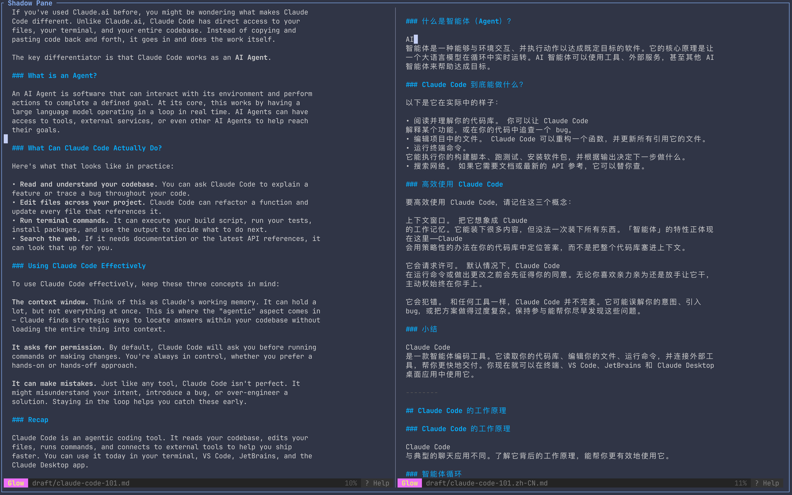

# herdr-shadow-pane

tmux 式 `synchronize-panes`，以 herdr 插件形式实现：把你的击键逐字符实时广播到当前 tab 的全部其他窗格。



## 工作方式

0. 已绑定快捷键 `prefix+shift+o`（见下方"快捷键"），或从 herdr action 菜单触发 **Shadow Pane: broadcast keystrokes**（或 `herdr plugin action invoke shaozk.herdr-shadow-pane.sync`）。
1. action 只是一个薄启动器：调用 `herdr plugin pane open` 把控制台作为 overlay 窗格打开。
2. 控制台 TUI 直接进入广播页，目标为当前 tab 的全部其他窗格（无需勾选）。
3. 广播页里你的每次击键都会实时转发给所有目标窗格；下方分格实时镜像每个目标的可见输出，并各自显示一个闪烁的块状影子光标（影分身），位置追踪该窗格镜像最后一行非空字符之后——即下一个广播字符的落点。
4. `Ctrl+Q` 退出，herdr 自动回收 overlay 窗格。

## 快捷键

在 `~/.config/herdr/config.toml` 中加入（`prefix` 默认为 `ctrl+b`）：

```toml
[[keys.command]]
key = "prefix+shift+o"
type = "plugin_action"
command = "shaozk.herdr-shadow-pane.sync"
description = "herdr-shadow-pane: broadcast keystrokes"
```

改完执行 `herdr server reload-config` 或按 `prefix+shift+r` 生效。

## 键位

| 广播页 | 行为 |
| --- | --- |
| 可打印字符 | 原样广播 |
| `enter` / `backspace` / `esc` / `ctrl+c` | 以逻辑键广播（send-keys） |
| 滚轮（上/下/左/右） | 以 `up` / `down` / `left` / `right` 方向键广播（send-keys） |
| `ctrl+q` | 退出（`ctrl+c` 是广播内容，不是退出） |
| 其他控制键 | 忽略并提示（v1 最小键集） |

## 实现说明

- Rust + crossterm + ratatui，无运行时依赖。
- 输入通道：可打印字符走 `herdr pane send-text`，控制键走 `herdr pane send-keys`；发送在独立线程异步执行（连续击键 ≤10ms 微批合并），并发扇出到所有存活目标，渲染循环不因发送阻塞。
- 鼠标：overlay 本就启用 mouse capture；滚轮事件（上/下/左/右）翻译为方向键走同一条 send-keys 批量通道广播给全部存活目标（滚动列表、翻页类 TUI 可直接用滚轮驱动），其余鼠标事件（点击、拖动、移动）仅消费不动作。
- 输出镜像：每个目标由独立后台读线程以 50ms 节拍拉取 `herdr pane read --source visible --format ansi`（约 20fps），渲染循环以 ~30ms 节拍消费更新并驱动影子光标 1Hz 闪烁；行数取控制台全高；解析前先规整行尾 CR（ansi 流每行以 `\r` 结尾，残留会在渲染时把光标拉回行首造成花屏）；分格无边框、以 1 列分隔线相隔，满屏目标可 1:1 完整显示（此前顶部几行会被状态行与边框遮挡）；以 ansi-to-tui 解析后原样渲染，目标窗格的原始样式（前景/背景/真彩色、加粗、反显等）与终端保持一致——目标里跑着 opencode，镜像就是 opencode 的样子；状态行仅在出现提示时临时占用 1 行，镜像底端对齐保证最新内容与影子光标始终可见。
- 影子光标：无法在目标窗格自身终端内绘制（其前台进程拥有屏幕），因此在控制台的每个目标镜像格中渲染一个反显块（落在“下一次广播字符将出现”的位置——光标本身的字符沿用该处原本的样式并加 REVERSED，像真终端光标那样盖在原字符上；如果该位置在内容末尾之后则是一个反显空格）。锚点由**屏幕 diff**追踪：每帧镜像相对上一帧找出变化最小的行（键入在文本区 → 变化落在被编辑的行；状态行光标计数器微变 + 文本变化 ≥ 阈值时只动文本行；整屏滚动等大重绘被忽略，沿用上次锚点），变化区域末尾的列即光标列；首次打开或锚点不可见（被底端对齐切片裁掉）时回退到启发式（镜像最后一行非空内容之后）。若锚点列超出分格宽度（如 helix 底部状态行把内容推到行尾远端），光标块按终端折行语义换到下一行行首，保证始终可见。目标窗格真实终端里，其原生光标会随广播输入自然移动。
- 布局保持：进入与广播全程不改动 pane 布局（不对齐尺寸）；进入时快照 tab 全部 split（id/direction/ratio），退出时逐 split 精确还原 ratio（一步到位，亚单元格容差）作为兜底，保证广播前后布局一致。
- 目标窗格中途关闭会被标记 `✕ dead` 并停发；全部失效时自动退出。
- 广播语义为逐字符直通，不做 bracketed paste；向 agent TUI 广播时其界面对渐进输入的反应（如补全跳动）属预期行为。

## 示例

广播页截图：[examples/shadow-pane-example.png](examples/shadow-pane-example.png)（见文首）

镜像输出样例：

- 中文：[examples/mirror.zh.md](examples/mirror.zh.md)
- English: [examples/mirror.en.md](examples/mirror.en.md)

## 开发与安装

要求 `herdr ≥ 0.8.0`。

从 GitHub 安装：

```sh
herdr plugin install <owner>/herdr-shadow-pane
```

本地开发（本仓库即插件根目录）：

```sh
make help       # 列出全部 make 目标
make build      # cargo build --release 并拷贝到 bin/（即 scripts/build.sh）
make install    # herdr plugin link .
make uninstall  # herdr plugin unlink shaozk.herdr-shadow-pane
```

调试：在任意窗格设置 `SHADOW_PANE_DEBUG_LIST=1` 后运行 `bin/herdr-shadow-pane`，打印解析到的 tab 上下文与窗格列表后退出。

## Roadmap（v1 明确不做）

- workspace / 跨 tab 作用域
- 尺寸对齐（把目标窗格拉到主窗格大小）
- 逐行（Enter 提交）广播模式
- bracketed paste 支持
- 全量键位映射（键盘方向键、Tab、Home/End、PgUp/PgDn、Ctrl+字母全表、F1–F12；滚轮→方向键已支持）
